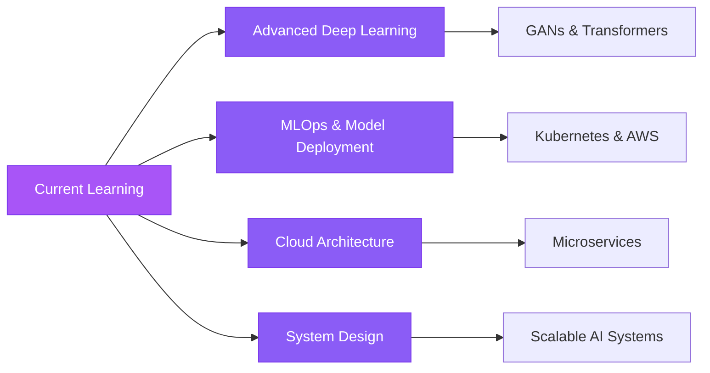

<div align="center">

<!-- Animated Header -->


<br/>

<!-- Animated Typing Text -->
<p align="center">
  
</p>

<!-- Animated Badges -->
<p align="center">
  
  
  
</p>

<!-- Social Badges with Animation -->
<p align="center">
  <a href="https://github.com/Rvbaghel">
    
  </a>
  <a href="https://linkedin.com/in/vishal-baghel-a055b5249">
    
  </a>
  
</p>

<!-- Wave Animation -->


</div>

---

##  About Me


```python
#!/usr/bin/env python3
# -*- coding: utf-8 -*-

class Developer:
    def __init__(self):
        self.name = "Vishal Baghel"
        self.role = "AI/ML Engineer & Full Stack Developer"
        self.location = "📍 Ahmedabad, Gujarat, India"
        self.education = "🎓 Gujarat University - Computer Science"
        self.language_spoken = ["hi_IN", "en_US"]
        
    def current_work(self):
        return {
            "🔭 Working on": "AI-Powered Applications",
            "🌱 Learning": "Advanced Deep Learning & MLOps",
            "👯 Open to": "Collaborate on AI/ML Projects",
            "💬 Ask me about": "Python, ML, Computer Vision, Web Dev",
            "⚡ Fun fact": "I turn coffee into code ☕→ 💻"
        }
    
    def get_tech_stack(self):
        return {
            "AI/ML": ["TensorFlow", "PyTorch", "YOLOv8", "OpenCV"],
            "Languages": ["Python", "TypeScript", "JavaScript"],
            "Frontend": ["React", "HTML5", "CSS3", "Tailwind"],
            "Backend": ["Django", "FastAPI", "Node.js"],
            "Tools": ["Git", "Docker", "VS Code", "Jupyter"]
        }

me = Developer()
print(me.current_work())
```

<br clear="right"/>

---

##  Tech Stack

<div align="center">

### 💻 Languages & Frameworks
<p>
  
</p>

### 🤖 AI/ML & Data Science
<p>
  
  
  
  
</p>

### 🛠️ Tools & Platforms
<p>
  
</p>

### 🗄️ Databases
<p>
  
</p>

</div>

---

## 🌟 Featured Projects

<div align="center">

<!-- Project Cards with Animations -->
<table>
<tr>
<td width="50%" valign="top">

<h3 align="center">🐄 Cows Detection CV</h3>

<div align="center">
  
<a href="https://github.com/Rvbaghel/Cows_Detection_Computer_Vision">
  
</a>

**Technologies:**


Custom YOLOv8 model for real-time livestock detection and counting with healthcare monitoring capabilities.

</div>

</td>

<td width="50%" valign="top">

<h3 align="center">🤕 Fall Detection CV</h3>

<div align="center">
  
<a href="https://github.com/Rvbaghel/Fall_Detection_Computer_Vision">
  
</a>

**Technologies:**


Real-time fall detection system for elderly care with instant alert capabilities.

</div>

</td>
</tr>

<tr>
<td width="50%" valign="top">

<h3 align="center">🌬️ AQI Frontend</h3>

<div align="center">
  
<a href="https://github.com/Rvbaghel/aqi-frontend">
  
</a>

**Technologies:**


Air Quality Intelligence Platform with real-time analytics and personalized health recommendations.

</div>

</td>

<td width="50%" valign="top">

<h3 align="center">📊 SmartDoc</h3>

<div align="center">
  
<a href="https://github.com/Rvbaghel/SmartDoc">
  
</a>

**Technologies:**


Modern full-stack document and image processing platform with advanced features.

</div>

</td>
</tr>

<tr>
<td width="50%" valign="top">

<h3 align="center">🏠 Housing Dashboard</h3>

<div align="center">
  
<a href="https://github.com/Rvbaghel/Housing-Dashboard-App">
  
</a>

**Technologies:**


Interactive dashboard for Indian housing data with ML-ready datasets.

</div>

</td>

<td width="50%" valign="top">

<h3 align="center">🏘️ India Housing Datasets</h3>

<div align="center">
  
<a href="https://github.com/Rvbaghel/india_housing_datasets">
  
</a>

**Technologies:**


Lightweight Python library providing standardized Indian housing datasets for ML.

</div>

</td>
</tr>

</table>

</div>

---

## 📊 GitHub Analytics

<div align="center">

<!-- Animated Stats Cards -->


</div>

<!-- Animated Contribution Snake -->
<div align="center">
  
</div>

---

## 🏆 GitHub Trophies

<div align="center">
  


</div>

---

## 💼 Current Focus

<div align="center">

<table>
<tr>
<td align="center" width="33%">

<br><br>
<b>🤖 Machine Learning</b>
<br>
<sub>Building intelligent systems<br>with TensorFlow & PyTorch</sub>
</td>
<td align="center" width="33%">

<br><br>
<b>👁️ Computer Vision</b>
<br>
<sub>Real-time object detection<br>with YOLOv8 & OpenCV</sub>
</td>
<td align="center" width="33%">

<br><br>
<b>🌐 Full Stack</b>
<br>
<sub>Modern web apps with<br>React & Django</sub>
</td>
</tr>
</table>

</div>

---

## 📈 Contribution Metrics

<div align="center">

<!-- Detailed Metrics -->


</div>

---

## 🎯 Skills & Expertise

<div align="center">

### Core Competencies

| Domain | Technologies | Proficiency |
|:------:|:------------:|:-----------:|
| 🤖 **Machine Learning** | TensorFlow, PyTorch, scikit-learn |  |
| 👁️ **Computer Vision** | YOLOv8, OpenCV, Image Processing |  |
| 🐍 **Python** | Django, FastAPI, Flask |  |
| ⚛️ **React** | Hooks, Context, TypeScript |  |
| 📊 **Data Science** | Pandas, NumPy, Matplotlib |  |
| 🐳 **DevOps** | Docker, Git, CI/CD |  |

</div>

---

## 🌱 What I'm Learning

<div align="center">



</div>

---

## 💡 Fun Facts

<div align="center">

 <em><b>I believe in continuous learning and staying updated with the latest tech trends!</b></em>

### Quick Stats

<table>
<tr>
<td align="center">

<br>
<b>☕ Coffee Consumed</b>
<br>
<code>Infinite ♾️</code>
</td>
<td align="center">

<br>
<b>💻 Hours Coding</b>
<br>
<code>10+ per day</code>
</td>
<td align="center">

<br>
<b>🚀 Projects Built</b>
<br>
<code>20+ and counting</code>
</td>
<td align="center">

<br>
<b>🎯 Current Goal</b>
<br>
<code>Master AI/ML</code>
</td>
</tr>
</table>

</div>

---

## 🤝 Let's Connect!

<div align="center">

<p>
  <a href="https://linkedin.com/in/vishal-baghel-a055b5249">
    
  </a>
  <a href="https://github.com/Rvbaghel">
    
  </a>
  <a href="mailto:your.email@gmail.com">
    
  </a>
  <a href="https://twitter.com/yourusername">
    
  </a>
</p>

### 💬 Feel free to reach out for:

- 🤝 Collaborations on AI/ML projects
- 💼 Freelance opportunities
- 🎓 Mentorship in Machine Learning
- 💡 Discussing innovative ideas
- ☕ Just a friendly chat!

</div>

---

## 💭 Random Dev Quote

<div align="center">


</div>

---

## 📺 Latest YouTube Videos

<div align="center">

<!-- If you have a YouTube channel, uncomment and add your channel ID -->
<!-- 
[](https://youtube.com/@yourchannel)

[](https://youtube.com/@yourchannel)
-->

</div>

---

## 🎮 When I'm Not Coding

<div align="center">

<table>
<tr>
<td align="center" width="25%">

<br>
<b>📚 Reading</b>
<br>
<sub>AI Research Papers</sub>
</td>
<td align="center" width="25%">

<br>
<b>🎵 Music</b>
<br>
<sub>Coding Playlists</sub>
</td>
<td align="center" width="25%">

<br>
<b>🎮 Gaming</b>
<br>
<sub>Strategy Games</sub>
</td>
<td align="center" width="25%">

<br>
<b>✈️ Travel</b>
<br>
<sub>Exploring Places</sub>
</td>
</tr>
</table>

</div>

---

## 🌟 Support My Work

<div align="center">

If you like my work and want to support me:

<p>
  <a href="https://www.buymeacoffee.com/yourusername">
    
  </a>
  <a href="https://github.com/sponsors/Rvbaghel">
    
  </a>
</p>

### ⭐ Show some love by starring my repositories!

</div>

---

<div align="center">

<!-- Bottom Wave Animation -->


<!-- Animated Footer Text -->


<br/>

<!-- Visitor Badge -->


<!-- Last Updated -->
<p><i>Last updated: Auto-updated by GitHub Actions ⚡</i></p>

<!-- Social Icons Footer -->
<p>
  <a href="https://linkedin.com/in/vishal-baghel-a055b5249"></a>
  <a href="https://github.com/Rvbaghel"></a>
  <a href="mailto:your.email@gmail.com"></a>
  <a href="https://twitter.com/yourusername"></a>
</p>

<br/>

**💜 Crafted with passion and lots of ☕ by Vishal Baghel**

</div>
